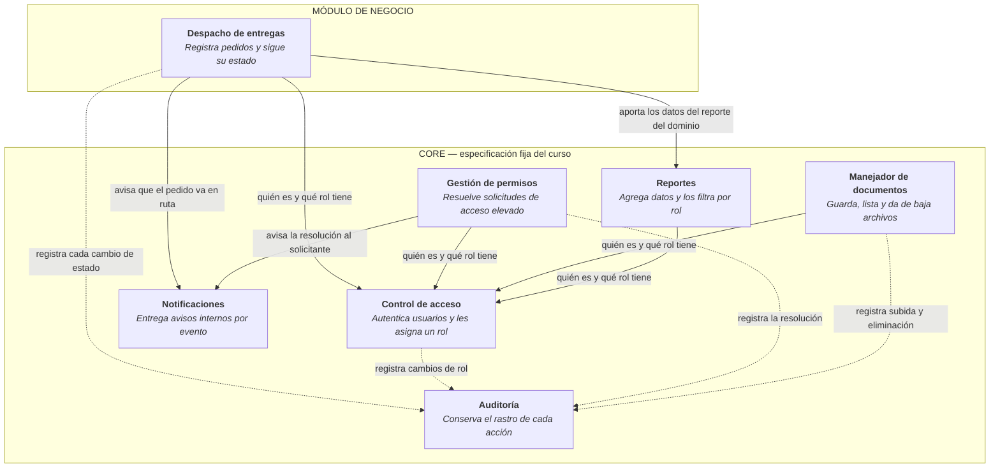
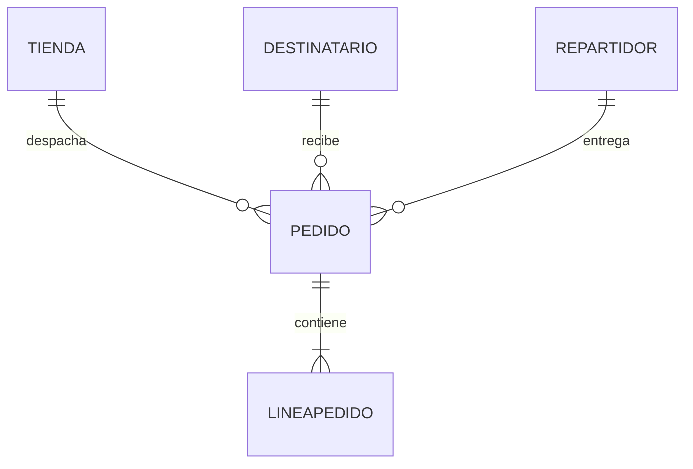
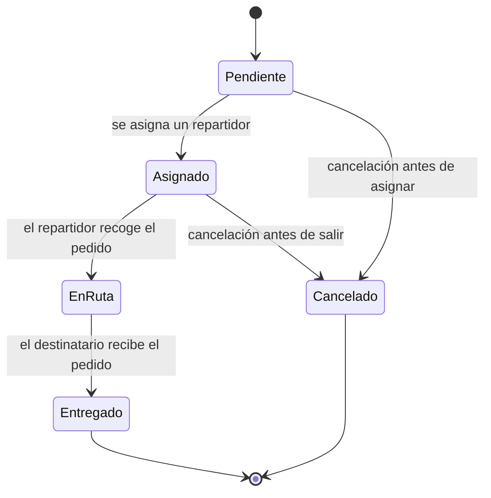

# Despacho de Entregas a Domicilio

Sistema de gestión de entregas para un servicio de reparto que opera
para varios comercios. Registra pedidos, los asigna a repartidores y
sigue el estado de cada entrega hasta su cierre.

Proyecto de **Programación III (TDS-007)** · ITLA · 2026-C-3

---

## Tecnologías

- **Lenguaje:** C# / .NET 8
- **Base de datos:** SQL Server
- **ORM:** Entity Framework Core
- **Pruebas:** xUnit
- **Contenedores:** Docker (desde la semana 9)

---

## Arquitectura

El proyecto tiene dos partes. El **Core** es la especificación fija del
curso, igual para los 25 proyectos. El **módulo de negocio** es el
dominio propio: el despacho de entregas.

La dependencia va en un solo sentido: el módulo de negocio consume el
Core, y el Core no conoce el módulo de negocio (RD-03).

### Diagrama de componentes

Todas las piezas se construyen en C#. Las flechas punteadas van hacia
Auditoría: casi toda operación relevante deja rastro, y se dibujan
punteadas para no saturar el diagrama.

**Ninguna flecha sale del Core hacia el módulo de negocio.** El Core no
sabe que existen los pedidos (RD-03).

---

## Módulo de negocio

### Entidades

| Entidad | Responsabilidad |
|---|---|
| `Tienda` | Comercio que despacha pedidos |
| `Destinatario` | Persona que recibe el pedido |
| `Pedido` | Solicitud de entrega. Contiene la máquina de estados |
| `LineaPedido` | Cada artículo dentro de un pedido |
| `Repartidor` | Persona asignada para entregar |

### Relaciones

### Máquina de estados del Pedido

- **Estado inicial:** `Pendiente`
- **Estados terminales:** `Entregado` y `Cancelado`. Ninguna transición
  parte de ellos (RF-NEG-05)
- **Transición prohibida explícita:** `Entregado → EnRuta`. El intento
  se rechaza y el estado no cambia (RF-NEG-04)
- Las transiciones se resuelven en un único punto del código (RD-04)

### Funcionalidades

1. Registrar un pedido con sus líneas
2. Asignar un repartidor a un pedido pendiente
3. Marcar un pedido como en ruta
4. Confirmar la entrega
5. Consultar el historial de pedidos por destinatario

---

## Cómo ejecutar el proyecto

> Pendiente. Se completa cuando exista código ejecutable (Práctica 1).

---

## Estado del proyecto

| Pieza | Semanas | Estado |
|---|---|---|
| Diseño de componentes | 2 | Hecho |
| Control de acceso | 2–4 | En curso |
| Gestión de permisos | 6–8 | Pendiente |
| Manejador de documentos | 9 | Pendiente |
| Notificaciones | 11–12 | Pendiente |
| Reportes | 12 | Pendiente |
| Auditoría | 14 | Pendiente |