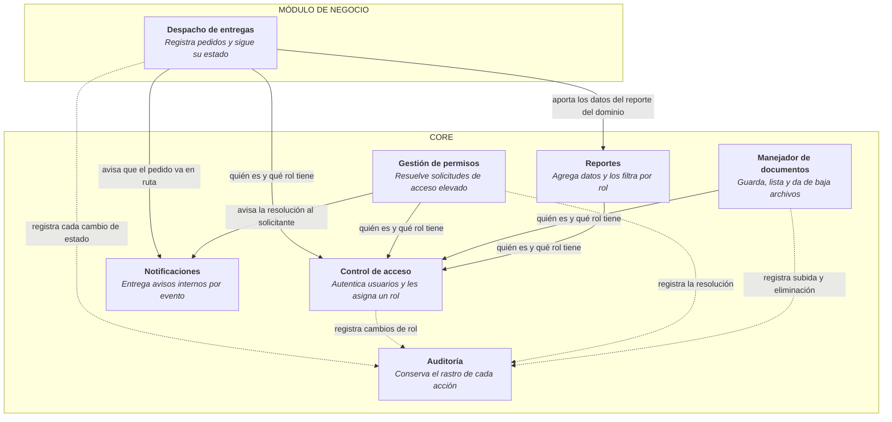
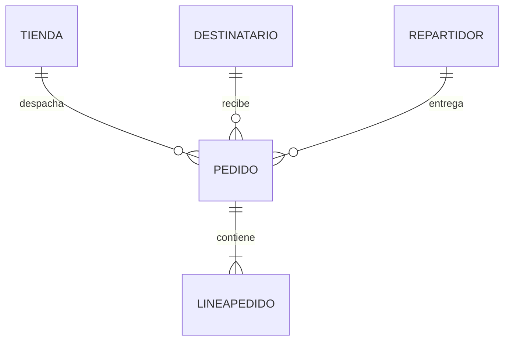
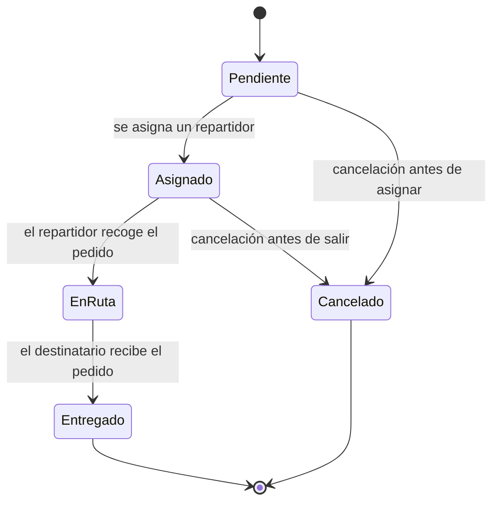

# Despacho de Entregas a Domicilio

Sistema de gestión de entregas para un servicio de reparto que opera
para varios comercios. Registra pedidos, los asigna a repartidores y
sigue el estado de cada entrega hasta su cierre.

Proyecto de **Programación III (TDS-007)** · ITLA · 2026-C-3 · Versión 0.1 · Prototipo en consola

---

## Tecnologías

- **Lenguaje:** C# / .NET 8
- **Base de datos:** SQL Server
- **ORM:** Entity Framework Core
- **Pruebas:** xUnit
- **Contenedores:** Docker (desde la semana 9)

---

## Arquitectura

El proyecto tiene dos partes. El **Core** es la especificación fija del
curso, igual para los 25 proyectos. El **módulo de negocio** es el
dominio propio: el despacho de entregas.

La dependencia va en un solo sentido: el módulo de negocio consume el
Core, y el Core no conoce el módulo de negocio (RD-03).

### Diagrama de componentes


```mermaid
flowchart TB
  subgraph CORE
    direction TB
    ACC["<b>Control de acceso</b><br/><i>Autentica usuarios y les asigna un rol</i>"]
    PERM["<b>Gestión de permisos</b><br/><i>Resuelve solicitudes de acceso elevado</i>"]
    DOC["<b>Manejador de documentos</b><br/><i>Guarda, lista y da de baja archivos</i>"]
    NOTI["<b>Notificaciones</b><br/><i>Entrega avisos internos por evento</i>"]
    REP["<b>Reportes</b><br/><i>Agrega datos y los filtra por rol</i>"]
    AUD["<b>Auditoría</b><br/><i>Conserva el rastro de cada acción</i>"]
  end

  subgraph NEGOCIO["MÓDULO DE NEGOCIO"]
    direction TB
    DESP["<b>Despacho de entregas</b><br/><i>Registra pedidos y sigue su estado</i>"]
  end

  DESP -->|quién es y qué rol tiene| ACC
  PERM -->|quién es y qué rol tiene| ACC
  DOC  -->|quién es y qué rol tiene| ACC
  REP  -->|quién es y qué rol tiene| ACC

  DESP -->|avisa que el pedido va en ruta| NOTI
  PERM -->|avisa la resolución al solicitante| NOTI

  DESP -->|aporta los datos del reporte del dominio| REP

  DESP -.->|registra cada cambio de estado| AUD
  ACC  -.->|registra cambios de rol| AUD
  PERM -.->|registra la resolución| AUD
  DOC  -.->|registra subida y eliminación| AUD
```

Todas las piezas se construyen en C#. Las flechas punteadas van hacia
Auditoría: casi toda operación relevante deja rastro, y se dibujan
punteadas para no saturar el diagrama.

**Ninguna flecha sale del Core hacia el módulo de negocio.** El Core no
sabe que existen los pedidos (RD-03).

---

## Módulo de negocio

### Entidades

| Entidad | Responsabilidad |
|---|---|
| `Tienda` | Comercio que despacha pedidos |
| `Destinatario` | Persona que recibe el pedido |
| `Pedido` | Solicitud de entrega. Contiene la máquina de estados |
| `LineaPedido` | Cada artículo dentro de un pedido |
| `Repartidor` | Persona asignada para entregar |

### Relaciones


```mermaid
erDiagram
    TIENDA       ||--o{ PEDIDO       : despacha
    DESTINATARIO ||--o{ PEDIDO       : recibe
    REPARTIDOR   ||--o{ PEDIDO       : entrega
    PEDIDO       ||--|{ LINEAPEDIDO  : contiene
```

### Máquina de estados del Pedido


```mermaid
stateDiagram-v2
    [*] --> Pendiente
    Pendiente --> Asignado  : se asigna un repartidor
    Asignado  --> EnRuta    : el repartidor recoge el pedido
    EnRuta    --> Entregado : el destinatario recibe el pedido
    Pendiente --> Cancelado : cancelación antes de asignar
    Asignado  --> Cancelado : cancelación antes de salir
    Entregado --> [*]
    Cancelado --> [*]
```

- **Estado inicial:** `Pendiente`
- **Estados terminales:** `Entregado` y `Cancelado`. Ninguna transición
  parte de ellos (RF-NEG-05)
- **Transición prohibida explícita:** `Entregado → EnRuta`. El intento
  se rechaza y el estado no cambia (RF-NEG-04)
- Las transiciones se resuelven en un único punto del código (RD-04)

### Funcionalidades

1. Registrar un pedido con sus líneas
2. Asignar un repartidor a un pedido pendiente
3. Marcar un pedido como en ruta
4. Confirmar la entrega
5. Consultar el historial de pedidos por destinatario

---

## Estado del proyecto

| Pieza | Semanas | Estado |
|---|---|---|
| Diseño de componentes | 2 | Hecho |
| Control de acceso | 2–4 | En curso |
| Gestión de permisos | 6–8 | Pendiente |
| Manejador de documentos | 9 | Pendiente |
| Notificaciones | 11–12 | Pendiente |
| Reportes | 12 | Pendiente |
| Auditoría | 14 | Pendiente |

---

## Cómo ejecutar (Práctica 1)

### Requisitos

- .NET SDK 8
- SQL Server local (instancia por defecto, autenticación de Windows)
- Herramienta de EF Core: `dotnet tool install --global dotnet-ef --version 8.0.11`
- Una cuenta de Gmail con verificación en dos pasos y una contraseña de aplicación

### Variables de entorno

Nunca se guardan en el repositorio. En PowerShell se ponen con `$env:NOMBRE = "<valor>"` y duran mientras la terminal esté abierta.

| Variable | Para qué |
|---|---|
| `DESPACHO_CONEXION` | Cadena de conexión a SQL Server. La usan la Api y el EnviadorCorreos |
| `DESPACHO_URL_ACTIVACION` | Dirección base del enlace de activación (la del endpoint `GET /api/cuentas/activar`) |
| `DESPACHO_ADMIN_CORREO` | Correo de un usuario ya registrado que la Api convierte en Administrador al arrancar |
| `SMTP_HOST` | Servidor SMTP |
| `SMTP_PUERTO` | Puerto del servidor SMTP |
| `SMTP_USUARIO` | Cuenta que inicia sesión en el servidor SMTP |
| `SMTP_CONTRASENA` | Contraseña de aplicación de esa cuenta |
| `SMTP_REMITENTE` | Dirección que aparece como remitente |

### Pasos

1. Crear la base de datos: `dotnet ef database update --project src/Despacho.Core --startup-project src/Despacho.Api`
2. Arrancar la Api (queda en `https://localhost:7063`): `dotnet run --project src/Despacho.Api --launch-profile https`
3. En otra terminal, enviar los correos pendientes: `dotnet run --project src/Despacho.EnviadorCorreos`

Para las peticiones se usa `curl.exe` con el cuerpo en un archivo JSON, por ejemplo:

```
@{ correo = "<correo>"; contrasena = "Prueba123" } | ConvertTo-Json | Set-Content $env:TEMP\registro.json
curl.exe -k -X POST https://localhost:7063/api/cuentas/registro -H "Content-Type: application/json" --data "@$env:TEMP\registro.json"
```

Para guardar el token del inicio de sesión y usarlo en las demás peticiones:

```
$token = (curl.exe -k -s -X POST https://localhost:7063/api/sesion/iniciar -H "Content-Type: application/json" --data "@$env:TEMP\login.json" | ConvertFrom-Json).token
curl.exe -k https://localhost:7063/api/sesion/yo -H "Authorization: Bearer $token"
```

### Cómo probar cada criterio

| Criterio | Cómo provocarlo | Resultado esperado |
|---|---|---|
| RF-CA-01 correo único | Registrar dos veces el mismo correo | La segunda vez responde 400 "Ya existe una cuenta con ese correo." |
| RF-CA-02 hash con sal | Registrar dos correos con la misma contraseña y ver la tabla `Usuarios` | Los dos `HashContrasena` son distintos |
| RF-CA-14 contraseña | Registrar con menos de 8 caracteres, sin letras o sin números | Responde 400 con la regla de la contraseña |
| RF-CA-15 nace inactivo | Registrarse y ver la tabla `Usuarios` | `Activada` = 0 y hay un correo pendiente en `CorreosEnCola` |
| RF-CA-16 activación | Correr EnviadorCorreos y abrir el enlace del correo | "Cuenta activada". Abrirlo otra vez o con el token vencido (24 h) da error |
| RF-CA-17 reenvío | `POST /api/cuentas/reenviar-activacion` con un correo que exista y con uno que no | Mismo mensaje en los dos casos; el enlace anterior deja de servir |
| RF-NOT-08 cola | Registrarse con `SMTP_CONTRASENA` incorrecta o sin internet | El registro responde bien y el correo queda pendiente |
| RF-NOT-09 sin duplicar | Correr EnviadorCorreos dos veces seguidas | La segunda vez dice "Correos enviados: 0" |
| RF-CA-03 inicio de sesión | `POST /api/sesion/iniciar` con datos correctos y con datos incorrectos | Correctos: devuelve un `token`. Incorrectos: 401 "Correo o contraseña incorrectos." sin decir cuál falló |
| RF-CA-15 cuenta no activa | Iniciar sesión con una cuenta que no ha abierto el enlace | 401 "La cuenta no está activa. Revisa tu correo para activarla." |
| RF-CA-07 usuario autenticado | `GET /api/sesion/yo` con el encabezado `Authorization: Bearer <token>` | Devuelve id, correo y rol |
| RF-CA-18 cierre de sesión | `POST /api/sesion/cerrar` con el token y luego `GET /api/sesion/yo` con el mismo token | `/yo` responde 401 "Sesión no válida." |
| RF-CA-19 bloqueo | 5 inicios de sesión con contraseña incorrecta y luego uno con la correcta | El sexto se rechaza: cuenta bloqueada 15 minutos. Un inicio correcto antes del quinto fallo pone el contador en cero |
| RF-CA-04 roles | Arrancar la Api con `DESPACHO_ADMIN_CORREO` y llamar `/api/sesion/yo` con ese usuario | Su rol es Administrador; los demás nacen Estandar |
| RF-CA-21 listar usuarios | `GET /api/usuarios` con el token del Administrador | Lista con id, correo, rol y estado, sin hashes ni tokens |
| RF-CA-05 y RF-CA-06 un solo punto | `GET /api/usuarios` con el token de un Estandar | 403 "No tienes permiso para esta operación." (lo revisa el filtro `FiltroRol`) |
| RF-CA-08 cambio de rol | `PUT /api/usuarios/{id}/rol` con `{"rol":"Administrador"}`, primero con token Estandar y luego con token Administrador | Estandar: 403, ni siquiera sobre sí mismo. Administrador: "Rol actualizado." |
| RF-CA-20 desactivar | `POST /api/usuarios/{id}/desactivar` y luego `/api/sesion/yo` e inicio de sesión con ese usuario; también con el id del propio Administrador | La sesión deja de valer, no puede iniciar sesión y el Administrador no puede desactivarse a sí mismo. `POST /api/usuarios/{id}/reactivar` lo vuelve a habilitar |
| RF-CA-09 recuperación | `POST /api/contrasenas/recuperar` con `{"correo": ...}`, con un correo que existe y con uno que no | Mismo mensaje en los dos casos |
| RF-CA-10 código por la cola | Pedir recuperación y correr EnviadorCorreos | Llega un código de 6 dígitos que vence en 30 minutos; pedir otro invalida el anterior |
| RF-CA-11 y RF-CA-12 restablecer | `POST /api/contrasenas/restablecer` con `{"correo", "codigo", "contrasenaNueva"}` | La contraseña vieja deja de servir, la nueva funciona, las sesiones anteriores dan "Sesión no válida." y el mismo código no se puede usar otra vez |
| RF-CA-13 restablecimiento forzado | `POST /api/usuarios/{id}/forzar-restablecimiento` con token de Administrador y correr EnviadorCorreos | El usuario recibe un código por correo y sus sesiones se cierran |
| RF-CA-22 cambio con sesión | `POST /api/contrasenas/cambiar` con `{"contrasenaActual", "contrasenaNueva"}` y el token | Con la actual incorrecta da error; con la correcta cambia, aplica la regla de RF-CA-14 y cierra las sesiones |
| RD-04 máquina de estados | Ver `docs/maquina-de-estados.md` | Tabla de transiciones, prohibida y terminales |

### Pendiente

Swagger no carga todavía; las pruebas se hacen con curl.
