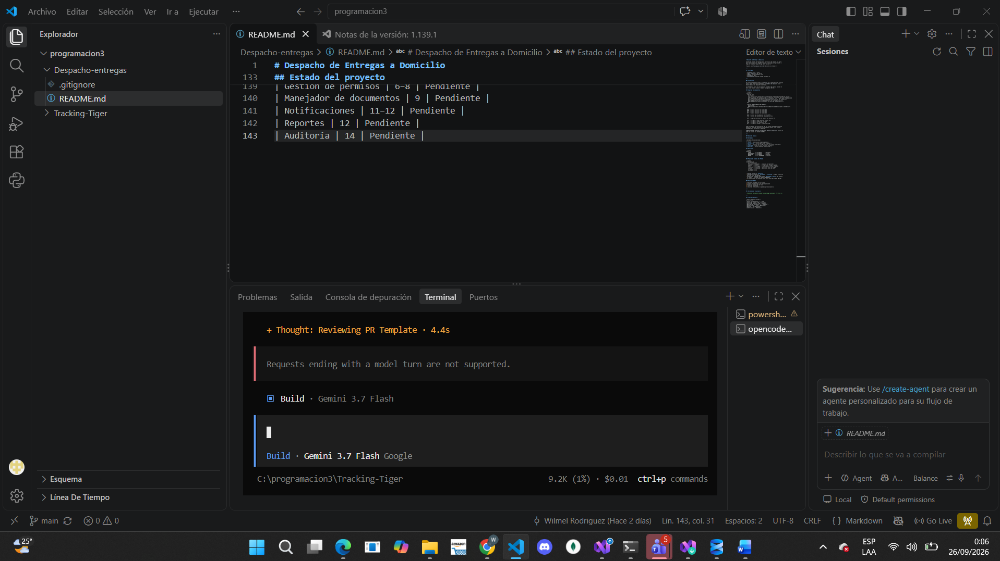
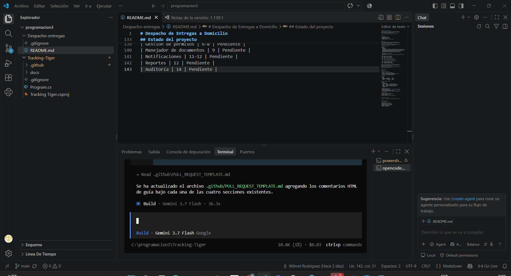

# Bitácora de sesión con el agente — Asignación 1

- **Estudiante:** Wilmel Rodriguez (`willrl20`)
- **Agente:** OpenCode 1.18.31 con el modelo Gemini 3.7 Flash
- **Fecha de la sesión:** 26 de septiembre de 2026

## Tarea delegada

Agregar guías de redacción a la plantilla de pull request del repositorio de mi pareja
(`greilenny26/Tracking-Tiger`). Es uno de mis tres aportes de la asignación.

### Qué le pedí

Le di este pedido exacto, en la carpeta del fork y en la rama `docs/guia-plantilla-pr`:

```
Edita solo el archivo .github/PULL_REQUEST_TEMPLATE.md. No cambies los cuatro títulos
que ya tiene. Debajo de cada título agrega una línea de guía como comentario HTML
(<!-- ... -->) que explique en una frase qué se escribe en esa sección. En "Por qué"
pide citar el requisito por su identificador, por ejemplo RD-10. No modifiques ningún
otro archivo y no hagas commit.
```

Le puse límites claros (un solo archivo, no tocar los títulos, no hacer commit) para
poder revisar el resultado antes de guardarlo en el historial.

### Qué devolvió

En el segundo intento agregó un comentario debajo de cada uno de los cuatro títulos:

| Sección | Guía agregada |
|---|---|
| Qué cambia | Describe de forma concisa los cambios principales y novedades implementadas en este pull request. |
| Por qué | Explica el motivo del cambio citando el requisito por su identificador (por ejemplo, RD-10). |
| Cómo probarlo | Indica los pasos necesarios para verificar y comprobar el correcto funcionamiento de los cambios. |
| Qué NO incluye | Especifica qué elementos o funcionalidades quedan explícitamente fuera del alcance de este pull request. |

## Error del agente

**Qué pasó:** en el primer intento, el agente empezó a trabajar (mostró "Thought:
Reviewing PR Template") pero se detuvo con este error, sin completar la tarea:

```
Requests ending with a model turn are not supported.
```

**Cómo lo detecté:** el mensaje apareció en rojo en la terminal de OpenCode y el agente
no reportó ningún archivo editado.

**Cómo lo corregí:** abrí una sesión nueva con `/new` y le di exactamente el mismo
pedido. Esta vez completó la tarea en unos 36 segundos.

## Cómo verifiqué el resultado


1. `git status`: confirmé que el único archivo modificado era
   `.github/PULL_REQUEST_TEMPLATE.md`.
2. `git diff`: confirmé que los cuatro títulos seguían iguales y que solo se agregaron
   las cuatro líneas de comentario.
3. Abrí el archivo completo en VS Code y lo leí antes de hacer el commit.

El commit y el pull request los hice yo:

- Commit `3268710` — "Agrega guías a la plantilla de pull request"
- Pull request: https://github.com/greilenny26/Tracking-Tiger/pull/2

## Lo que no delegué

- El `.gitignore` (PR #3) lo edité a mano porque eran cuatro líneas.
- El README de ejecución (PR #4) lo escribí después de instalar .NET 10 y ejecutar el
  proyecto de mi pareja con `dotnet run` en mi máquina, para que cada paso estuviera
  comprobado.

## Qué aprendí

- Un error del agente no siempre significa que el pedido está mal. Aquí el problema fue
  de la sesión, y abrir una nueva lo resolvió.
- Que el agente diga "se ha actualizado el archivo" no prueba nada. `git status` y
  `git diff` sí.
- Darle límites explícitos en el pedido hace que el resultado sea fácil de revisar.

## Evidencia

Primer intento, con el error (26/09/2026, 00:06):



Segundo intento, en una sesión nueva (26/09/2026, 00:09):

